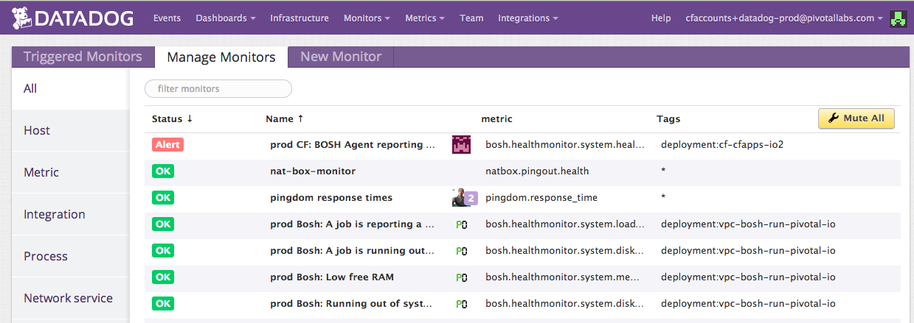
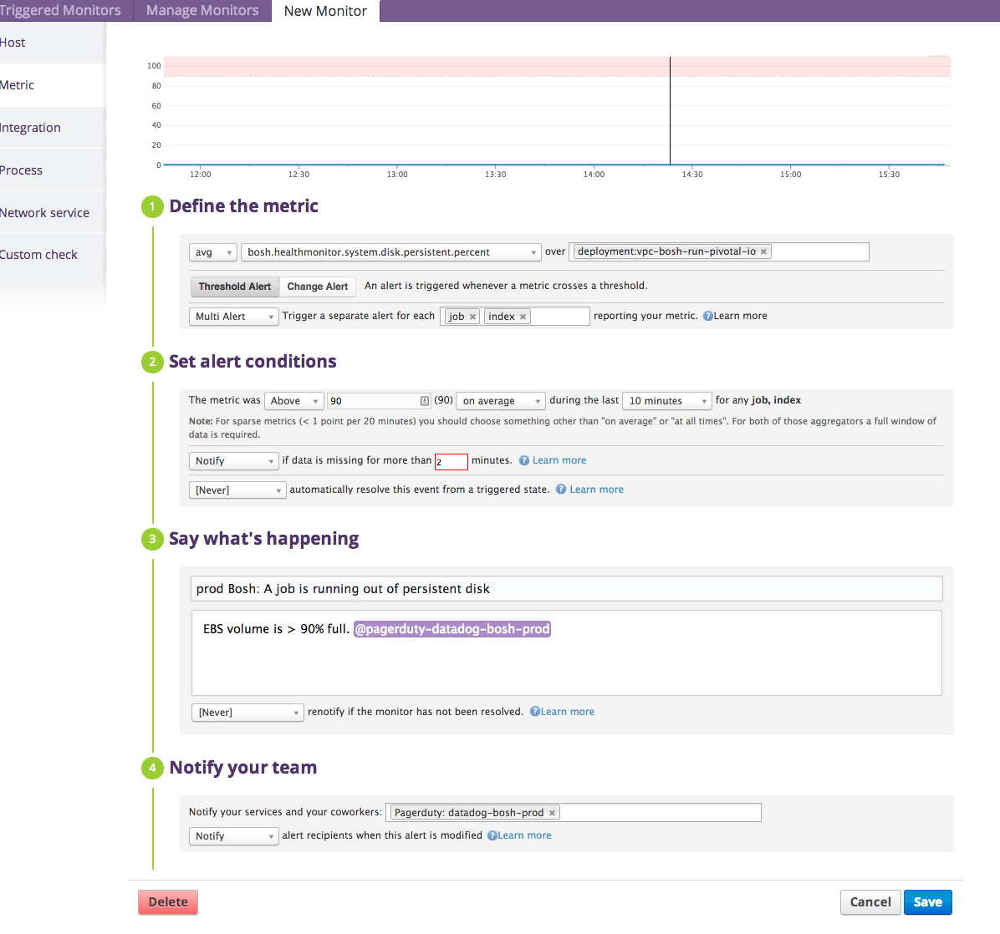

# Alert templates

Alerts here are used to generate metric monitors. Based on the configuration, one can send alerts to an individual directly or to a PagerDuty service. 

These alerts wind up here: 

Examples of alerts include [this bosh disk health monitor](https://app.datadoghq.com/monitors#create/metric?id=14385):

## Define the metric
The query to trigger against. 

## Set alert conditions
The value that the query must meet in order to trigger a notification. 

## Say what's happening
The message to say and to who. Define who by adding an @the-person-or-team-i-am-telling.

## Notify your team
Another way to populate the notifications. 

# Creating new alerts
- [ ] Create the alert, but do not as of yet turn on paging. 
- [ ] Point the alert to either nothing (examine triggered events through datadog)
  or point it at a non-pager, such as an email alias. 
- [ ] During prod stand up (on Tuesdays), make sure the affected team is told 
that they will start receiving pages
- [ ] Turn on the alerts after the affected parties are cognizant. 
