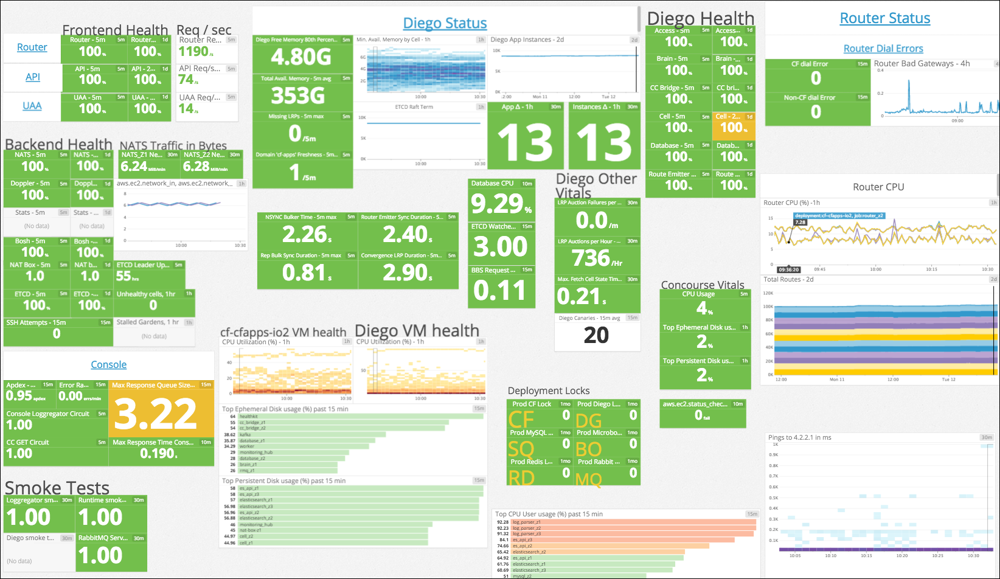
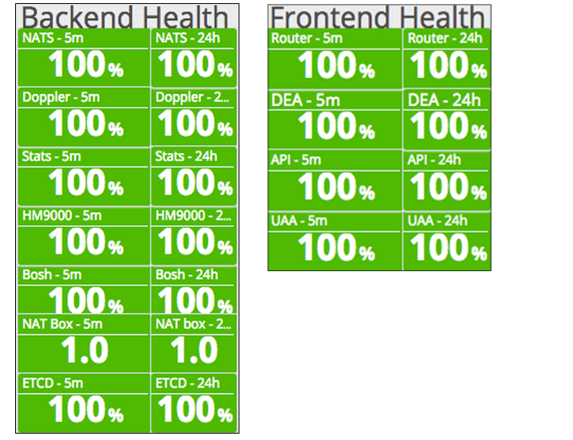
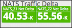
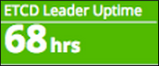
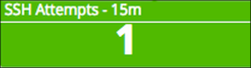
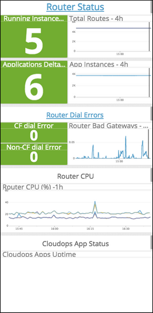

# The Pivotal Cloud Ops Approach to Monitoring a Pivotal Cloud Foundry Deployment

**NOTE: This content originally published as part of [Pivotal Cloud Foundry documentation](http://docs.pivotal.io/pivotalcf/1-6/opsguide/metrics.html). The PCF Docs team replaced it with more current content and moved it here for safe keeping.

Contributors to this `datadoc-config-oss` may have their way with this page in this location, no questions asked.**

The Pivotal Cloud Ops team monitors the health of its Cloud Foundry deployments using a customized Datadog dashboard. This topic describes each of the key metrics as they are rendered in the custom dashboard, and why the Cloud Ops team uses them for monitoring the health of a Cloud Foundry deployment.

<strong>Note</strong>: Pivotal does not officially support Datadog.

Cloud Ops' practices are tailored to the specific details of the Cloud Foundry deployments they operate. Therefore, the descriptions here are meant to be informative examples rather than general prescriptions. Pivotal recommends that operators experiment with different combinations of metrics and alerts appropriate to their specific requirements.

The Cloud Ops team's custom configuration of Datadog's dashboards, alerts, and screenboards can be found in the [Datadog Config repository](https://github.com/pivotal-cf-experimental/datadog-config-oss).

## BOSH Health Monitor

<table border='1' class='nice'>
<tr>
  <th width="22%">What we monitor</th>
  <td>Health, broken down by component. Each row displays the average percentage of healthy instances for the relevant component over the last 5 minutes, and over the last 24 hours.
      For example, suppose that your Router has ten instances. If one instance becomes unhealthy, the stoplight turns red and shows 90%.
      We monitor health for the following components:  
    <ul>
      <li>NATS</li>
      <li>Doppler</li>
      <li>Stats</li>
      <li>HM9000</li>
      <li>BOSH</li>
      <li>NAT Box</li>
      <li>ETCD</li>
      <li>Router</li>
      <li>API</li>
      <li>UAA</li>
    </ul>
  </td>
</tr>
<tr>
  <th>Why we monitor it</th>
  <td>To ensure that all VMs are functioning properly.</td>
</tr>
<tr>
  <th>System metric</th>
  <td><code>bosh.healthmonitor.system.healthy</code></td>
</tr>
<tr>
  <th>Alerts triggered</th>
  <td>None</td>
</tr>
<tr>
  <th>Notes</th>
  <td>
Alerts generated from this metric are passed to a buffer queue in our alerting system, Pagerduty. Because BOSH restores systems quickly if they fail, we wait two minutes before forwarding any unresolved alerts to our operators.
  </td>
</tr>
</table>

### Requests per Second

<table border='1' class='nice'>
<tr>
  <th width="22%">What we monitor</th>
  <td>
    Requests per second for each of the following components:  
    <ul>
      <li>Router</li>
      <li>API</li>
      <li>UAA</li>
    </ul>
  </td>
</tr>
<tr>
  <th>Why we monitor it</th>
  <td>To track the flow of traffic through the components in the system.</td>
</tr>
<tr>
  <th>System metric</th>
  <td>
    <code>cf.collector.router.requests(component: app/cloudcontroller/uaa)</code>
  </td>
</tr>
<tr>
  <th>Alerts triggered</th>
  <td>None</td>
</tr>
<tr>
  <th>Notes</th>
  <td>None</td>
</tr>
</table>

### NATS Traffic Delta

<table border='1' class='nice'>
<tr>
  <th width="22%">What we monitor</th>
  <td>Delta of average NATS traffic over the last hour.
      
    The displayed metric is the difference between the average NATS traffic
    over the last 30 minutes and the average NATS traffic over the interval
    from 90 to 60 minutes prior.
  </td>
</tr>
<tr>
  <th>Why we monitor it</th>
  <td>To detect significant drops in NATS traffic. A sudden drop might indicate a problem with the health of the NATS VMs.</td>
</tr>
<tr>
  <th>System metric</th>
  <td><code>aws.ec2.network_in</code></td>
</tr>
<tr>
  <th>Alerts triggered</th>
  <td>None</td>
</tr>
<tr>
  <th>Notes</th>
  <td>None</td>
</tr>
</table>

### ETCD Leader Uptime

<table border='1' class='nice'>
<tr>
  <th width="22%">What we monitor</th>
  <td>
    Time since the ETCD leader last was down.
  </td>
</tr>
<tr>
  <th>Why we monitor it</th>
  <td>When the ETCD leader goes down, it usually indicates a push failure.</td>
</tr>
<tr>
  <th>System metric</th>
  <td><code>cloudops_tools.etcd_leader_health</code></td>
</tr>
<tr>
  <th>Alerts triggered</th>
  <td>None</td>
</tr>
<tr>
  <th>Notes</th>
  <td>The <code>cloudops_tools</code> metrics are generated by an internal app that the Pivotal Cloud Ops team developed. These metrics are not available on other Cloud Foundry deployments.</td>
</tr>
</table>

### SSH Attempts

<table border='1' class='nice'>
<tr>
  <th width="22%">What we monitor</th>
  <td>
    Total SSH attempts. We log the count of connection attempts to our systems on the SSH port (port 22).
  </td>
</tr>
<tr>
  <th>Why we monitor it</th>
  <td>A spike in SSH attempts is a good indicator of SSH-cracker attacks.</td>
</tr>
<tr>
  <th>System metric</th>
  <td><code>cloudops_tools.ssh-abuse-monitor</code></td>
</tr>
<tr>
  <th>Alerts triggered</th>
  <td>None</td>
</tr>
<tr>
  <th>Notes</th>
  <td>
    <ul>
      <li>Diego cells send their iptables logs to Logsearch. A Cloud Ops internal app polls Logsearch for first packets and pushes the count to Datadog.</li>
      <li>The <code>cloudops_tools</code> metrics are generated by an internal app that the Pivotal Cloud Ops team developed. These metrics are not available on other Cloud Foundry deployments.</li>
    </ul>
  </td>
</tr>
</table>

## The Router Status Column

### App Instance Count

<table border='1' class='nice'>
<tr>
  <th width="22%">What we monitor</th>
  <td>Count of running app instances.</td>
</tr>
<tr>
  <th>Why we monitor it</th>
  <td>Unexpected large fluctuations in app count can indicate malicious user behavior or Cloud Foundry component issues.</td>
</tr>
<tr>
  <th>System metric</th>
  <td>
    <code>avg:cf.collector.HM9000.HM9000.NumberOfAppsWithAllInstancesReporting</code>
  </td>
</tr>
<tr>
  <th>Alerts triggered</th>
  <td>running app number change rate</td>
</tr>
<tr>
  <th>Notes</th>
  <td>Spikes in this metric might indicate the need to add more resources. </td>
  </tr>
</table>

### Total Routes

<table border='1' class='nice'>
<tr>
  <th width="22%">What we monitor</th>
  <td>Route count from the router, indicated as a delta over the last N minutes.</td>
</tr>
<tr>
  <th>Why we monitor it</th>
  <td>The count on all routers should be the same. If this count differs between routers, it usually indicates a NATS problem.
  </td>
</tr>
<tr>
  <th>System metric</th>
  <td><code>cf.collector.router.total_routes</code></td>
</tr>
<tr>
  <th>Alerts triggered</th>
  <td>prod CF: Number of routes in the router's routing table is too low</td>
</tr>
<tr>
  <th>Notes</th>
  <td>
  The router is the only point of access into all Cloud Foundry components and customer apps. Large spikes in this graph typically indicate a problem, and could indicate a denial of service attack. For example, if the router goes down or does not have routes, the system is down and a large dip appears in the graph. However, some large spikes, such as those that would occur during a marketing event, are expected. Small fluctuations are not reflected on the graph.
  </td>
</tr>
</table>

### Router Dial Errors

<table border='1' class='nice'>
<tr>
  <th width="22%">What we monitor</th>
  <td>Separate indicators monitor 5xx codes from the routers to backend CF components and user apps, respectively.
</td>
</tr>
<tr>
  <th>Why we monitor it</th>
  <td>Indicates failures connecting to components.</td>
</tr>
<tr>
  <th>System metric</th>
  <td><code>avg:cloudops_tools.app_instance_monitor.router.dial.errors{domain:run.pivotal.io} / avg:cloudops_tools.app_instance_monitor.router.dial.errors{cf_component:false}</code></td>
</tr>
<tr>
  <th>Alerts triggered</th>
  <td>
    <ul>
      <li>No data for router dial errors</li>
      <li>Router dial errors for console.run.pivotal.io</li>
      <li>Too many router dial errors for cf components</li>
    </ul>
  </td>
</tr>
<tr>
  <th>Notes</th>
  <td>
    <ul>
      <li>
        We investigate dial errors to admin domain apps, the Cloud Controller, UAA, Dopplers, and any other BOSH-deployed Cloud Foundry component. We expect dial errors from our large population of customer apps (4000+). 502s occur when customers push flawed apps, or are running dev iterations. 5xx messages in the 500/10 min range are normal. If we saw this number to jump to 1000+/10 min, we would investigate.
      </li>
      <li>
        The <code>cloudops_tools</code> metrics are generated by an internal app that the Pivotal Cloud Ops team developed. These metrics are not available on other Cloud Foundry deployments.
       </li>
    </ul>
  </td>
</tr>
</table>

### Router CPU

<table border='1' class='nice'>
<tr>
  <th width="22%">What we monitor</th>
  <td>OS-level CPU usage.</td>
</tr>
<tr>
  <th>Why we monitor it</th>
  <td>Routers are multi-threaded and consume a large number of CPU cycles. If the routers are using too much CPU, we use BOSH to scale them.</td>
</tr>
<tr>
  <th>System metric</th>
  <td><code>bosh.healthmonitor.system.cpu.user{deployment:cf-cfapps-io2,job:<router_job>}</code></td>
</tr>
<tr>
  <th>Alerts triggered</th>
  <td>None</td>
</tr>
<tr>
  <th>Notes</th>
  <td>In general, we add routers whenever doing so may resolve issues.</td>
</tr>
</table>

### AWS Events

<table border='1' class='nice'>
<tr>
  <th width="22%">What we monitor</th>
  <td>The feed from <code>aws ec2 events</code>. </td>
</tr>
<tr>
  <th>Why we monitor it</th>
  <td>Contains important or critical information from our IaaS about virtual machines, RDS, etc.</td>
</tr>
<tr>
  <th>System metric</th>
  <td>N/A</td>
</tr>
<tr>
  <th>Alerts triggered</th>
  <td>None</td>
</tr>
<tr>
  <th>Notes</th>
  <td>Only applies to Cloud Foundry deployments on AWS.</td>
</tr>
</table>
