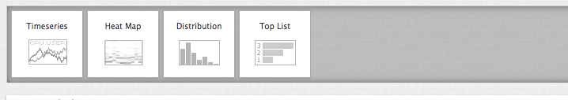
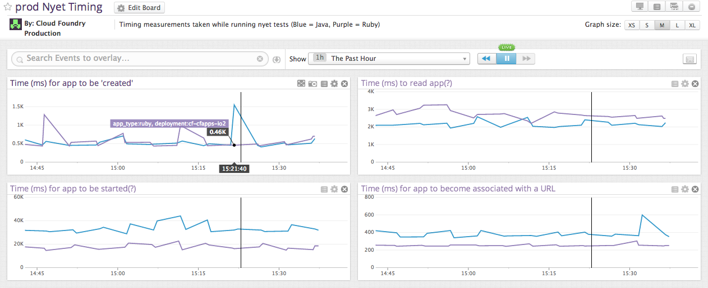

# Dashboard/timeboards templates

A *dashboard*  really refers to a *timeboard*. A timeboard allows for multiple graphs that refer to the same timespan. This allows for comparison of multiple values along the same timeline. Because of this feature, there are less widgets available to it than to a [screenboard](../screen_templates/README.md). 

Widgets:

Examples of screenboards include the [prod Nyet Timing board](https://app.datadoghq.com/dash/dash/10348):

