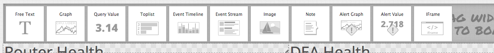
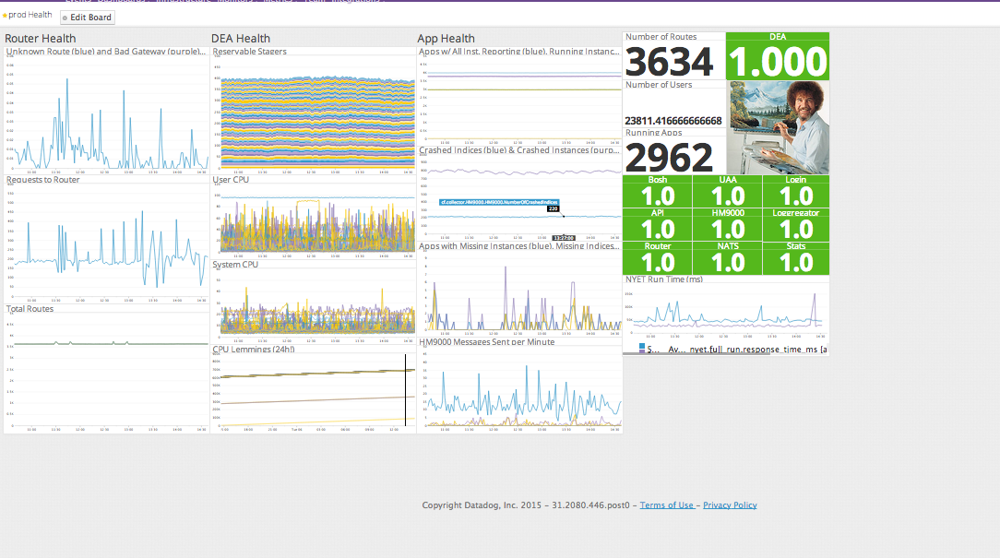

# Screen templates

A screenboard is different from a [dashboard](../dashboard_templates/README.md) in that the screenboard does not have the time synchronization feature and as a result has more widgets available to it, including stoplight features. 
   
A screenboard is a different API endpoint than a dashboard.  

Widgets: 

Examples of screenboards include the [prod health screenboard](https://app.datadoghq.com/screen/board/127):

